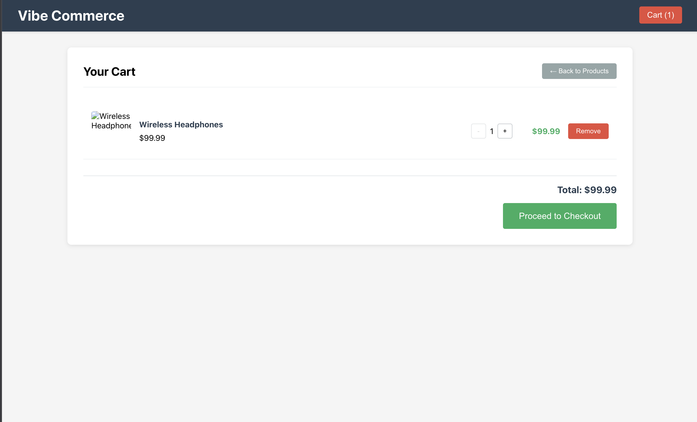
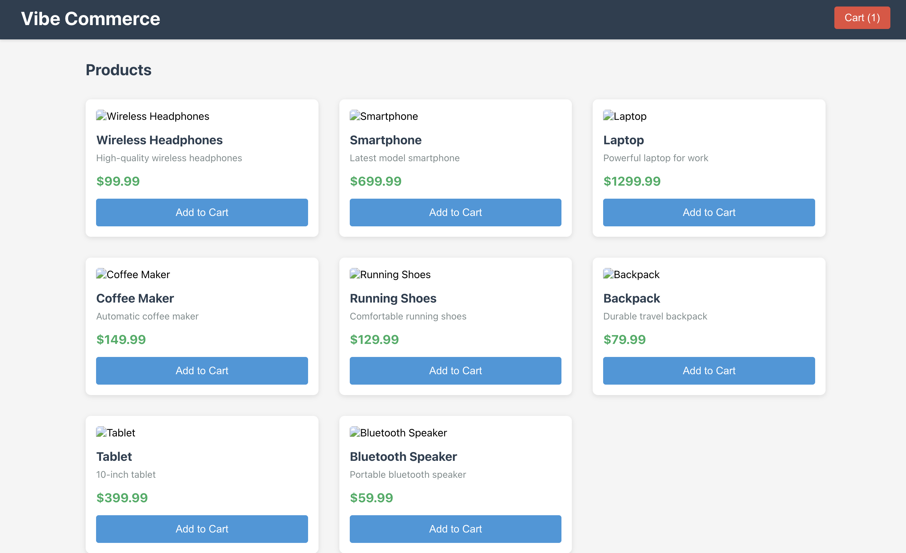

# Vibe Commerce - Full Stack Shopping Cart

A complete full-stack e-commerce shopping cart application built with React, Node.js/Express, and MongoDB.

## Features

### Backend API
- **GET /api/products**: Fetch 8 mock products with id, name, price, image, and description
- **POST /api/cart**: Add items to cart with productId and quantity
- **DELETE /api/cart/:id**: Remove specific item from cart
- **GET /api/cart**: Get current cart items and total
- **PUT /api/cart/:id**: Update item quantity in cart
- **POST /api/checkout**: Process checkout with customer info and return mock receipt

### Frontend Features
- **Product Grid**: Responsive grid displaying all products with "Add to Cart" functionality
- **Shopping Cart**: View cart items, update quantities, remove items, see total
- **Checkout Flow**: Customer form (name/email) with order summary and receipt modal
- **Responsive Design**: Mobile-friendly layout that works on all screen sizes

### Bonus Features Implemented
- **MongoDB Integration**: Full database persistence for products and cart
- **Error Handling**: Comprehensive error handling on both frontend and backend
- **Mock User System**: Cart persistence for mock user sessions
- **Responsive UI**: Clean, modern design that works on mobile and desktop

## Tech Stack

- **Frontend**: React 18, Axios for API calls, CSS3 with responsive design
- **Backend**: Node.js, Express.js, MongoDB with Mongoose
- **Database**: MongoDB for data persistence
- **Development**: Nodemon for hot reloading, Concurrently for running both servers

## Project Structure

```
vibe-commerce-cart/
├── client/                 # React frontend
│   ├── src/
│   │   ├── components/
│   │   │   ├── ProductGrid.js
│   │   │   ├── Cart.js
│   │   │   └── CheckoutModal.js
│   │   ├── App.js
│   │   └── App.css
│   └── package.json
├── server/                 # Express backend
│   ├── models/
│   │   ├── Product.js
│   │   └── Cart.js
│   ├── routes/
│   │   ├── products.js
│   │   ├── cart.js
│   │   └── checkout.js
│   ├── index.js
│   └── package.json
└── README.md
```

## Installation & Setup

### Prerequisites
- Node.js (v14 or higher)
- MongoDB (local installation or MongoDB Atlas)
- npm or yarn

### Quick Start

1. **Install dependencies**:
   ```bash
   npm install
   cd server && npm install && cd ..
   cd client && npm install && cd ..
   ```

2. **Make sure MongoDB is running**:
   ```bash
   brew services start mongodb/brew/mongodb-community
   # or just: mongod
   ```

3. **Start the application**:
   ```bash
   ./run-app.sh
   ```

4. **Access the application**:
   - Frontend: http://localhost:3000
   - Backend API: http://localhost:8000

### Manual Setup

If you prefer to run servers separately:

1. **Backend setup**:
   ```bash
   cd server
   npm install
   node index.js
   ```

2. **Frontend setup** (in new terminal):
   ```bash
   cd client
   npm install
   npm start
   ```

## API Endpoints

### Products
- `GET /api/products` - Get all products

### Cart Management
- `GET /api/cart` - Get current cart
- `POST /api/cart` - Add item to cart
  ```json
  {
    "productId": 1,
    "quantity": 2
  }
  ```
- `PUT /api/cart/:id` - Update item quantity
- `DELETE /api/cart/:id` - Remove item from cart

### Checkout
- `POST /api/checkout` - Process checkout
  ```json
  {
    "name": "John Doe",
    "email": "john@example.com"
  }
  ```

## Environment Variables

Create a `.env` file in the server directory:

```env
PORT=8000
MONGODB_URI=mongodb://localhost:27017/vibe-commerce
```

## Usage Flow

1. **Browse Products**: View the product grid on the homepage
2. **Add to Cart**: Click "Add to Cart" on any product
3. **View Cart**: Click the cart button in the header to see cart items
4. **Manage Cart**: Update quantities or remove items as needed
5. **Checkout**: Click "Proceed to Checkout" and fill in customer details
6. **Receipt**: View order confirmation with order ID and details

## Database Schema

### Product Model
```javascript
{
  id: Number,
  name: String,
  price: Number,
  image: String,
  description: String
}
```

### Cart Model
```javascript
{
  userId: String,
  items: [{
    productId: Number,
    name: String,
    price: Number,
    quantity: Number,
    image: String
  }],
  total: Number,
  timestamps: true
}
```

## Development Notes

- The application uses a mock user system (userId: 'mock-user')
- Products are automatically seeded on first API call if database is empty
- Cart persists in MongoDB between sessions
- All API responses include proper error handling
- Frontend includes loading states and error handling

## Future Enhancements

- User authentication and multiple user support
- Product categories and search functionality
- Payment integration (Stripe, PayPal)
- Order history and tracking
- Product reviews and ratings
- Inventory management
- Admin dashboard for product management

## License

This project is created for Vibe Commerce internship screening purposes.
